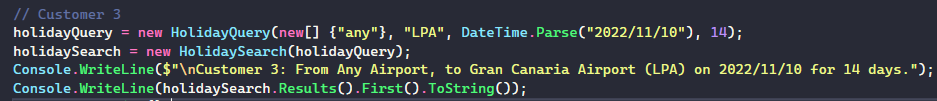
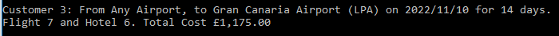

# OTB-Holiday-Search
A C# app library of code that provides a basic holiday search feature.

It takes in two JSON files as input, which contain hotel data and flight data, and then returns the best value holiday based on the customer search criteria.

## Usage

The code can be run by cloning this repository and launching the solution file in Visual Studio. The customer test cases can be found in the `Program.cs` file. Additional customer tests can be added by using the format of the existing ones.

Sample Input:

Sample Output:

## Structure

The library consists of 2 projects. One for the Search app and another for all the tests. The test project uses the same folder hierachy as the main project and all classes have their corresponsing test files (where relevant).
